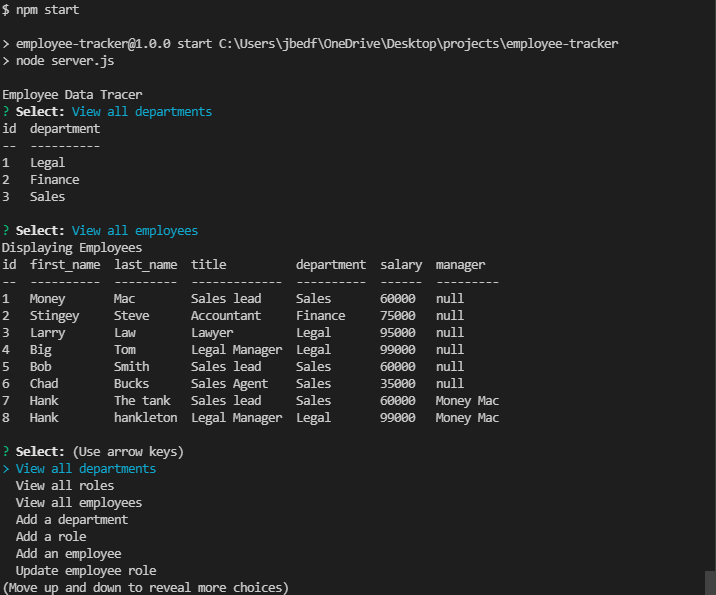

# employee-tracker

## Description 
An appliction used to keep track of current employee data, add in new employees to a database and add update roles

## Installation
This application requires mysql2, Inquirer, Node.js and console.table

## Built with 
-Mysql
-Node.js
-Inquirer 

## Video link

https://watch.screencastify.com/v/QsUrYckmo4dfsG1u0rO8

## Screenshot

